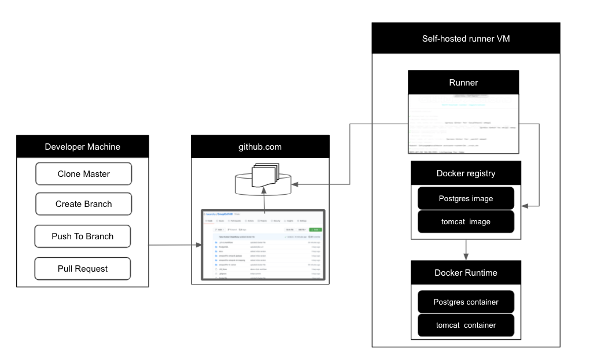
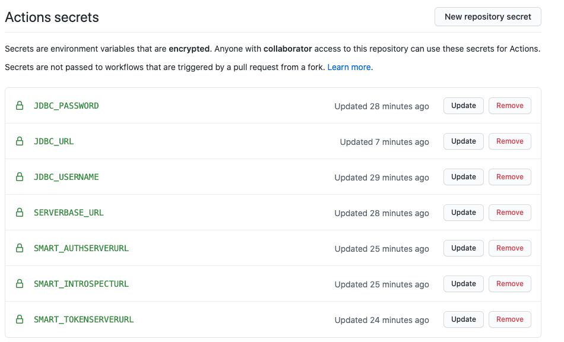

# CI/CD Pipeline Development - OMOP On FHIR Java Stack

## Table of Contents
**[Author](#Author)** 
**[High Overview of scope of work](#High-Overview-of-scope-of-work)** 
**[Overall Solution Architecture](#Overall-Solution-Architecture)** 
**[Prerequsite](#Prerequsite)** 
**[Hosted Runner Setup](#Hosted-Runner-Setup)** 
**[Partial Automation of DB Setup](#Partial-Automation-of-DB-Setup)** 
**[Add Github repo Secrets](#Add-Github-repo-Secrets)** 
**[Automation of Web application Build and Deployment](#Automation-of-Web-application-Build-and-Deployment)** 
**[End To End Testing](#End-To-End-Testing)** 
**[Code](#Code)** 
**[Demo](#Demo)** 

## Author

Tarun Kumar CHawdhury
Special Problems - CS-8903-D17 - Secondary Project

## High Overview of scope of work

This scope here to create CI/CD pipeline for existing OMOP on FHIR Project Java stack  lead by @myung using GitHub Action events and pipeline. The project here cloned from public repository - https://github.com/omoponfhir/omoponfhir-main  created by @myung. This work has accomplished following key aspects:

- Create higlevel design and solution architecture

- Identify Host Machine and Setup Self-Hosted Runner based on solution Architecture

- Create Github action Workflow for manual trigger event for Postgress DB container

- Trigger Action flow manually and validate DB container correctly started in identified host docker runtime

- Peform Manual steps to create DB Schema and load data with  required Vocabulary

- Add configuration parameters for web container as Github Secrets

- Create Github action workflow for web container CI/CD pipeline

- Commit and Push the code and validate gothub action workflow trigger automatically and started web container in docker runtime in identifed hosted machine

- Validate web container URL is coming properly by inspecting conformance resource

## Overall Solution Architecture

## Prerequsite

- github.com private Repository or github enterpirse version 3.0 and above

- A unit linux machine which comply requirement for hosted runner mentioned here - <https://docs.github.com/en/enterprise-server@2.22/actions/using-github-hosted-runners/about-github-hosted-runners>

## Hosted Runner Setup

### Create a folder in server where Hosted Runner will be installed

#### Download

$ mkdir actions-runner && cd actions-runner# Download the latest runner package

$ curl -o actions-runner-osx-x64-2.278.0.tar.gz -L https://github.com/actions/runner/releases/download/v2.278.0/actions-runner-osx-x64-2.278.0.tar.gz

#### Extract the installer

$ tar xzf ./actions-runner-osx-x64-2.278.0.tar.gz

#### Configure

##### Create the runner and start the configuration experience

$ ./config.sh --url https://github.com/tarunchy/OmopOnFHIR --token ****(This can be retrived by clicking Settings->Actions->Runners->Add Self-Hosted runner)****

##### Last step, run it!

$ ./run.sh

#### Using self-hosted runner .github->workflow->pipeline.yaml file

##### Use this YAML in your workflow file for each job

runs-on: self-hosted

## Partial Automation of DB Setup

DB Setup is partially atuomated due licesning issue with different codes and vacculebary. Following Steps needs to be followed to configure database

### 1. Create Github Action Workflow

A Github action workflow called https://github.com/tarunchy/OmopOnFHIR/blob/main/.github/workflows/posgress.yaml created which needs to be triggered manually.

### 2. Load Data Manually

This is manul step and needs to be completed based on existing envionment setup document - OMOPonFHIR – FHIR R4 to OMOP v6.0

Based on the document some of the key steps are:

a. git clone https://github.gatech.edu/cs6440-hub/OMOPonFHIR-OMOPv60-PSQL.git

b. docker exec -it omop_v6 psql -U postgres -c "CREATE DATABASE omop;" -c "\c omop" -c "CREATE SCHEMA results;"

c. psql -U postgres -h localhost -p 5432 -d omop -f "OMOP CDM postgresql ddl.txt"

d. psql -U postgres -h localhost -p 5432 -d omop -f "OMOP CDM postgresql pk indexes.txt"

e. psql -U postgres -h localhost -p 5432 -d omop -f "OMOP CDM Results postgresql ddl.txt"

f. psql -U postgres -h localhost -p 5432 -d omop -f "OMOP CDM vocabulary load - PostgreSQL.sql"

g. psql -U postgres -h localhost -p 5432 -d omop -f "omoponfhir_f_person_table_ddl.txt"

h. psql -U postgres -h localhost -p 5432 -d omop -f "omoponfhir_v6.0_f_observation_view_ddl.txt"

i. docker exec -it omop_v6 /bin/bash 
j. su postgres 
k. psql omop < names.dmp
l. psql -U postgres -h localhost -p 5432 -d omop -f "insert_names_to_f_person.sql"

Please refer to the document for more detail on Data Loading. 

### 2. Execute workflow manullay from Github Action UI in Github.com

## Add Github repo Secrets

Add following evnionment configuration and passwords into Github Sercets. This will vary based on taregt hosting envionment. Java Code and Docker file should not include any sensitive information like db username, password, url etc.

## Automation of Web application Build and Deployment

Web Application build and demployment to hosted runner server is fully automated with github action workflow https://github.com/tarunchy/OmopOnFHIR/blob/main/.github/workflows/pipeline.yaml. The workflow gets triggered based push of code to main or master branch or based on pull request approval and merge to main branch. 

## End To End Testing

Once workflow is complete we can validate if application is up and runnring by opening a browser window and trying access following URL:

http://runner_host_IP:8080/omoponfhir4

Note: Runner Host IP information needs to be updated in following files:

https://github.com/tarunchy/OmopOnFHIR/blob/main/Dockerfile

Both workflow file and Docker files has DB password in plain text which is not recommended. However as DB will be behind the firewall it wont accessable outside. So testing purpose its mentioned here. However developer when working on their own branch needs to change this.

## Code

- https://github.com/tarunchy/OmopOnFHIR
- https://github.gatech.edu/tchawdhury3/8903_Omop_On_FHIR

The above code is cloned from public repository - https://github.com/omoponfhir/omoponfhir-main created by @myung. The automation setup can only be tested in github version 3.0 and abive where github actions CI/CD workflow is enabled. Current GT enterprise github verion is still in 2.21.6

## Demo

https://www.youtube.com/watch?v=ZKTeFYLUF94 